[](http://creativecommons.org/licenses/by-nc-sa/4.0/)

# The Three-Dimensional Koch Snowflake - Fun Fractals at Home

Welcome! This is an article that we are writing with six hands: Marc, the Father, mathematician and a little handyman in his spare time, Sasha, 12, and Félix, 8. We started by exploring some mathematical concepts from the Koch Snowflake, everyone brought a lot of enthusiasm to it and we ended up going much further than expected ... to Scratch programming, 3D printing, and ultimately writing this article. Suffice to say that we had a great time on this project ... and now we want to share it with you!

**Summary**
- [Koch Snowflake](#koch-snowflake)
  - [Draw the Snowflake](#draw-the-snowflake)
  - [A bit of Arithmetic](#a-bit-of-arithmetic)
  - [Program the Snowflake in Scratch](#program-the-snowflake-in-scratch)
- [How about moving to 3D?](#how-about-moving-to-3d)
  - [The Tetrahedron](#the-tetrahedron)
  - [The Snowflake in 3D - Step 1](#the-snowflake-in-3d---step-1)
  - [The Snowflake in 3D - Recurrence](#the-snowflake-in-3d---recurrence)
  - [Print the Snowflake](#print-the-snowflake)
  - [What to do with these Snowflakes?](#what-to-do-with-these-snowflakes)
  
# Koch Snowflake

## Draw the Snowflake

The [Koch snowflake](https://en.wikipedia.org/wiki/Koch_snowflake) is a very well-known shape among mathematicians! It is easy to draw, it has very funny mathematical properties: its perimeter is infinite, while its area remains finite, and above all it is a beautiful example of [fractal](https://en.wikipedia.org/wiki/Fractal): the parts of the snowflake look like the snowflake itself ... but smaller!

Let's start by drawing the snowflake. We start from an equilateral triangle. Then, we cut each side of the triangle into three equal sub-segments. And we glue an equilateral triangle, three times smaller than the first, on each of the central segments.

Now let's delete the central segments. In other words, we replaced each central segment by two new segments, of the same length, which form an angle of 60 ° with the initial segment:
| Triangle | Let's add small triangles | Let's erase the interior segment |
| --- | --- | --- |
| 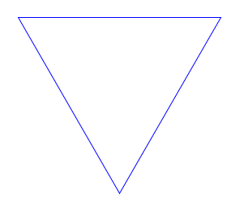 | 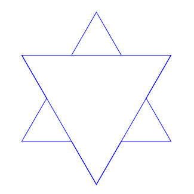 |  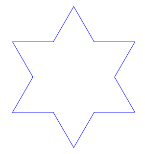 |

We can start the operation again! We now have 12 segments. Let's cut them each into 3, and replace each of the central segments with two new segments. So that makes us 48 segments, doesn't it? And so on!

| 48 segments | 192 segments |
| --- | --- |
| 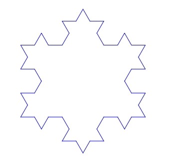 | 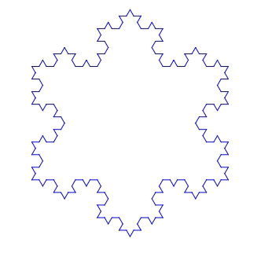 |

Let's not be afraid of anything ... here are snowflakes with 768 or even 3072 or 12288 sides ... but it is getting a bit long to draw ...
| 768 | 3072 | 12288 |
| --- | --- | --- |
| 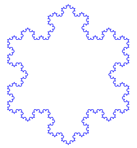 | 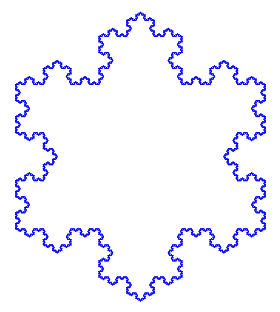 | 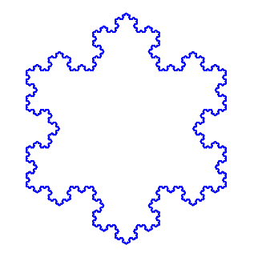 |

## A bit of Arithmetic

The Koch snowflake is well known for its mathematical properties. At each stage, its perimeter and area increase ... but not in the same proportions!

Let's imagine that the initial triangle has sides of length 7.29cm (we will be able to divide 7.29 many times by 3, hence this choice!) At each step, the number of sides of the snowflake is multiplied by 4, and each side becomes 3x shorter.

| | Triangle | Snowflake 1 | Snowflake 2 | Snowflake 3 | Snowflake 4 | Snowflake 5 | Snowflake 6 |
| ------------------ | -------- | -------- | -------- | -------- | -------- | -------- | -------- |
|                    |  |  |  |  |  |  |  |
| Number of sides | 3 | 12 | 48 | 192 | 768 | 3072 | 12288 |
| Length of one side | 7.29cm | 2.43cm | 0.81cm | 0.27cm | 0.09cm | 0.03cm | 0.01cm |
| Total scope | 21.87cm | 29.16cm | 38.88cm | 51.84cm | 69.12cm | 92.16cm | 122.88cm |

Each time the snowflake is increased by one degree, the perimeter is multiplied by 4/3. Which means that we can multiply it like this to infinity ... which, obviously, also takes an infinite time!

The perimeter will exceed (and stay beyond) any value. For example:
- It exceeds the meter in step 6
- the kilometer at stage 30
- and even the light year at step 134!

Mathematicians say in this case that the perimeter _tends to infinity_.

And the area of the snowflake?

Well, we can calculate it. To each operation, we add triangles which have a side three times smaller than the triangles of the previous level, and which therefore have an area 9 times smaller. And the number of these new triangles is equal to the number of segments of the Snowflake, which is multiplied by 4 at each step.

As the calculation is a bit laborious, we wrote a small program:
```python
import math


def compute_snowflake_area(triangle_area, max_degree):
    # Initialization: the triangle
    snowflake_area = triangle_area
    segment_count = 3
    for degree in range (0, max_degree + 1):
        print (f"Snowflake of degree {degree}: {segment_count} sides, {snowflake_area} cm2")

        # Area of the higher degree snowflake
        triangle_area /= 9
        snowflake_area += triangle_area * segment_count
        segment_count *= 4


triangle_side_length = 7.29
triangle_area = math.sqrt (3) / 4 * triangle_side_length ** 2

compute_snowflake_area(triangle_area, 120)
```

Which give:
```                           
Snowflake of degree 0: 3 sides, 23.01207033063029 cm2
Snowflake of degree 1: 12 sides, 30.68276044084039 cm2
Snowflake of degree 2: 48 sides, 34.09195604537821 cm2
Snowflake of degree 3: 192 sides, 35.60715409183946 cm2
Snowflake of degree 4: 768 sides, 36.280575445822244 cm2
Snowflake of degree 5: 3072 sides, 36.57987382537014 cm2
Snowflake of degree 6: 12288 sides, 36.712895327391436 cm2
```

We can run the program longer, and we see that the area increases less and less quickly! Even after a while the program always gives the same number: `36.81931252900848 cm2`. The area continues to increase, but we can no longer see it because the program does not display enough decimal places ...
```
Snowflake of degree 118: 331283824645947061796868281389297221717653230664178554647801162742366208 sides, 36.81931252900848 cm2
Snowflake of degree 119: 1325135298583788247187473125557188886870612922656714218591204650969464832 sides, 36.81931252900848 cm2
Snowflake of degree 120: 5300541194335152988749892502228755547482451690626856874364818603877859328 sides, 36.81931252900848 cm2
```

Mathematicians say that the area _converge_, and they even know how to calculate the value of the limit, equal to `2a²√3/5=36.819312529008464...`, cf. the article on [Koch Snowflake](https://en.wikipedia.org/wiki/Koch_snowflake) at Wikipedia.

The Koch snowflake is therefore an example of a shape with a finite area, and an infinite perimeter!

## Program the Snowflake in Scratch

It was Félix who introduced us to Scratch! Scratch is a great project from the Massachusetts Institute of Technology (MIT). It is a very accessible programming language for children. The instructions are very visual. You can try Scratch directly on the [MIT site](https://scratch.mit.edu/projects/editor/), without installing anything!

### Let's start with a Triangle

Before drawing the Snowflake, we will use Scratch to draw an equilateral triangle.
The program is quite simple: we move the character forward and then turn, and this three times:

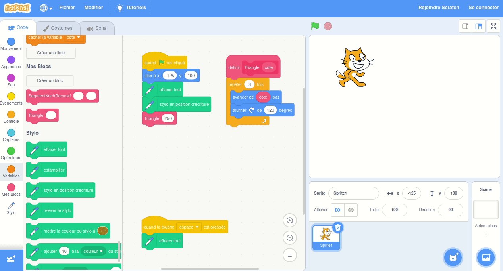

You noticed, didn't you, that we make the character turn at an angle of 120 °, and not 60 ° ... let's admit that we started by trying 60 °, but then we obtained a hexagon and not a triangle. This is because the angle should be the change in direction, not the angle made by the two segments!

If you want to try out the program that draws the triangle yourself, it is available in the [`scratch`](scratch) folder of this project - it's [`triangle.sb3`](scratch/triangle.sb3).

### To us the Flocon!

To program the snowflake, let's see which trajectory the Scratch character will have to follow. Each segment of the triangle will be replaced by a series of 4 segments:


Let's do the exercise of describing this trajectory:
- we draw a segment of length 3 times smaller than the initial segment
- then, we turn 60 ° counterclockwise
- we draw another segment
- turn 120 ° clockwise
- before drawing the third segment
- finally, we turn 60 ° in the opposite direction
- and we draw the last segment.

For the triangle, we had already used a _block_ in scratch. Here, we replace the instruction "advance 250 steps" that we had for the triangle by "to make a segment of length 250 steps in the current direction". And this "make a segment" block will itself make the 4 segments that we described above ... In other words, it will call the same block 4 times!

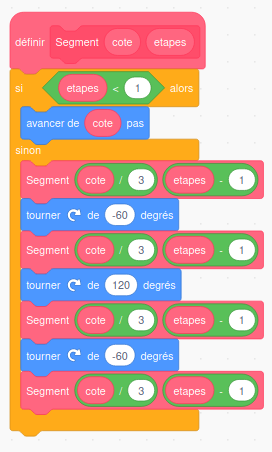

Of course, you have to be careful not to call the same block indefinitely, otherwise the program would never end! So, in our program, we ask the sub-segment to be
- three times shorter
- and take one step less


We are ready! By the way, if you want to try it with us, the program is also available in the [`scratch`](scratch) folder - it's the [`flocon.sb3`](scratch/flocon.sb3) file.

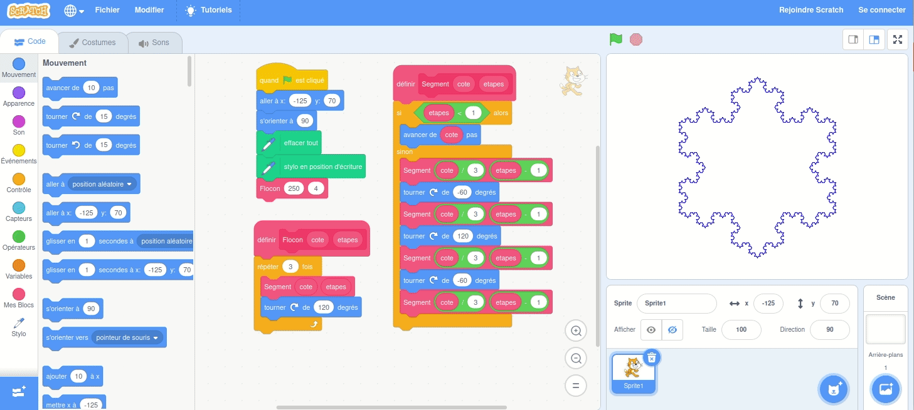

# How about moving to 3D?

The 2D Koch snowflake is super cool ... are you curious to see what it looks like in 3D?

## The Tetrahedron

In three dimensions, the equivalent of the triangle is the tetrahedron. It is the regular polyhedron whose 4 faces are equilateral triangles.

We started by building the tetrahedron with [OpenSCAD](https://www.openscad.org/).

In OpenSCAD, we create the tetrahedron by giving the coordinates of all the points, then by enumerating all the faces. The code is written

```

H = sqrt(3);         // It is the height of an equilateral triangle of side 2
T = 2 * sqrt(6) / 3; // It is the height of a regular tetrahedron of side 2

polyhedron(
    // The 4 vertices of the tetrahedron
    points=[
        // 4 points with each time the three coordinates: x, y, z
        [-1,0,0], [1,0,0], [0,H,0], [0,H/3,T]
        ],
    
    // The 4 triangles which make the tetrahedron
    faces=[
        // 4 faces which each connect 3 vertices (the 4 vertices are numbered from 0 to 3)
        [0,1,2], [3,2,1], [3,1,0], [3,0,2]
        ]
    );
```

How were the coordinates of the vertices determined?
- We first placed the first two vertices on the `x` axis, at coordinates `-1` and `+1`. Our tetrahedron will therefore have a side equal to 2.
- Then we looked for the [height of the equilateral triangle](https://en.wikipedia.org/wiki/Equilateral_triangle) on Wikipedia. The height is equal to `√3/2` times the side. So we place the third vertex at `y=√3`.
- The vertex of the tetrahedron is above the center of gravity of the horizontal triangle, one third of the height of the triangle. It will therefore have for coordinate `y=√3/3`.
- Finally, Wikipedia tells us that the [height of the tetrahedron](https://en.wikipedia.org/wiki/Tetrahedron) is equal to `√6/3` times its side. We therefore choose `z=2√6/3` for this point.

In OpenSCAD, we execute the code with F5 (preview), and we get this:

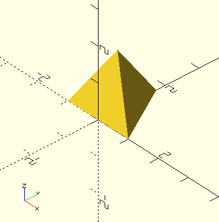

OpenSCAD also allows you to export 3D files in STL format (F6 then F7). You can find our tetrahedron in STL format [here](stl/tetrahedron.stl), and visualize it in 3D on GitHub, or even print it in 3D!

[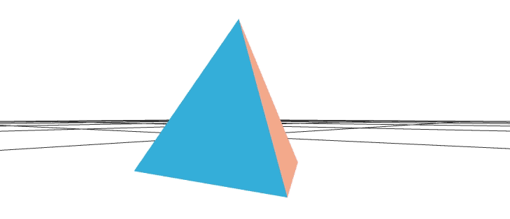](stl/tetrahedron.stl)

## The Snowflake in 3D - Step 1

Remember: to advance the construction of the two-dimensional Koch snowflake one step, you had to add a side triangle equal to one third of the segment, to each segment.

In three dimensions we will try the same approach. To each equilateral triangle, we will add a new tetrahedron!

Let's do it for only one face: we'll get a total of six equilateral triangles.

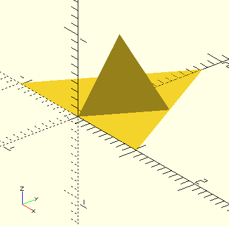

The question is ... how are we going to program this?

Let's study the program below:
```
H = sqrt(3);

module triangle() {
polyhedron(
    points=[[-1,0,0], [1,0,0], [0,H,0]],
    faces=[[0,1,2]]);
};

translate([0,H/3,0])
scale(1/2)
for (angle = [0,120,240])
{
    rotate([0,0,angle])
    translate([0,H/3,0])
    {   
        triangle();
        rotate([109.5,0,0]) mirror([0,0,1]) triangle();
    };
};
```

- With the `triangle` module, we define a function capable of drawing a triangle with side equal to 2. It is the base of the previous tetrahedron.
- To draw the 6 triangles, we use a loop which makes us rotate in space, 0, 120 or 240 °: these are the instructions `for (angle=[0,120,240])` and `rotate ([0,0 , angle]) `
- We want each of these 6 triangles to be 2x smaller than the original triangle, hence the `scale (1/2)` instruction which reduces the scale by a factor of 2.
- Finally, the figure must have the same center of gravity (in the `(x, y)` plane), hence the instruction `translate ([0, H/3, 0])` which positions us on this point before doing the rotations
- Finally, we draw two triangles (and this, three times, thanks to the `for` loop) at a distance` H/3` from the center of rotation, hence the second instruction `translate ([0, H/3, 0]) `. The first triangle is in the original plane. The other makes an angle of 109.5 ° with respect to this plane. We found this angle by _dichotomy_: if we put a smaller value, the central tetrahedron is open, and if it is larger, the triangles intersect ... The exact value is probably a little different - it is perhaps the angle [_Vertex-Center-Vertex_](https://en.wikipedia.org/wiki/Tetrahedron) equal to `2 arctan (√2)=109.4712 ...` according to Wikipedia.

## The Snowflake in 3D - Recurrence

To iterate the steps of the Snowflake in 3D, we will replace the call to `triangle()` by a call to `snowflake_face(n-1)`. The corresponding file is available at [`flocon_3d.scad`](source/flocon_3d.scad) in the [`source`](source) folder.

Open it in OpenSCAD, and change the value in `snowflake_face(3)` on the last line, then press F5.
Be careful not to put too large values... Remember that for `n=0` we have only one triangle, but that at each step we create six times more, in other words for` n=5` we will already have 7776 triangles ... beyond that, the exponential growth of triangles is likely to get the better of OpenSCAD, or even block your computer.

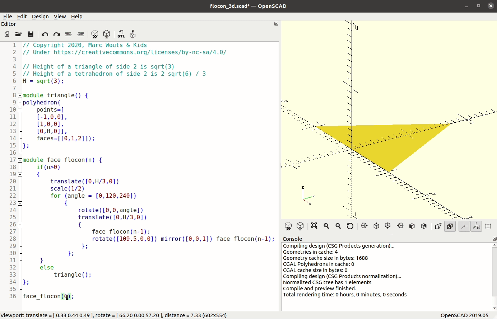

Did you like us find the result a little disappointing? The 3D Snowflake surface converges to a very simple shape ... an irregular tetrahedron (with a height equal to half the height of the regular tetrahedron). To check that we were not mistaken, we again used [Wikipedia](https://en.wikipedia.org/wiki/Koch_snowflake).

Let's look for example at the face of the 3D Snowflake with `n=4`:

[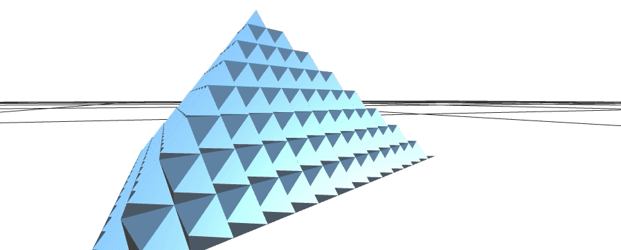](stl/face_flocon_4.stl)

A little too regular for a fractal, isn't it?

In fact, the fractal side of the 3D snowflake only appears when turned over! Feel free to click on the image to interact with the 3D file yourself.

[](stl/face_flocon_4.stl)

## Print the Snowflake

We discovered 3D printing during the first lockdown ... It's very simple: the printer gradually builds the requested shape by melting a plastic wire. It's great ... but hey, it's a bit slow ... and not always easy to fix!

In the case of Flocon 3D, the first problem we encountered was that our Flocon weighed 0 grams ... in other words, the printer did not print anything at all!

You will encounter the same problem if you attempt to print the STL files that we have generated so far. Indeed, our STL files describe only a _surface_, and not a _volume_.

If we really want to print the Snowflake, we will have to give it a little thickness, and replace the basic shape, i.e. the `triangle ()`, by a volume which _ resembles_ the triangle but which will have a little material.

We did this with the following function:
```
module thick_triangle(h) {
polyhedron (
    points=[
    [-1.0, h], [1.0, h], [0, H, h],
    [-1.0, -h], [1.0, -h], [0, H, -h]],
    // vertices in clockwise order seen from the outside
    faces=[[0,1,2], [1,0,3,4], [2,1,4,5], [0,2,5,3], [5,4,3]]) ;
};
```
in the file [`flocon_3d_imprimable.scad`](source/flocon_3d_imprimable.scad). Note that, to prevent the triangles from getting too thin when we apply the recursion, we multiply the `h` argument by 2 at each step, to compensate for the change in scale. The result is the following form:

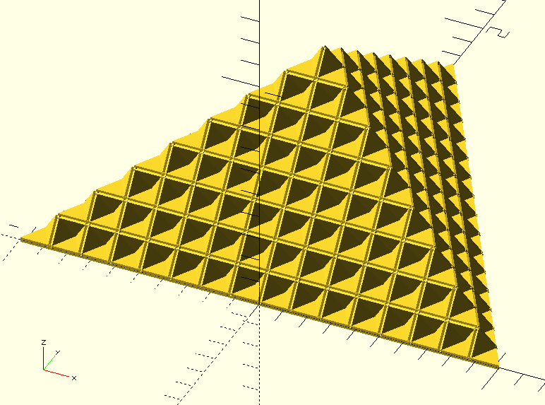

You can generate the STL files yourself (F5, F6 then F7 in OpenSCAD, it takes some time already for `n=4`) or you can get them in the [`stl_imprimables`](stl_imprimables) folder.

To print, open the file in [Cura Ultimaker](https://ultimaker.com/en/software/ultimaker-cura):

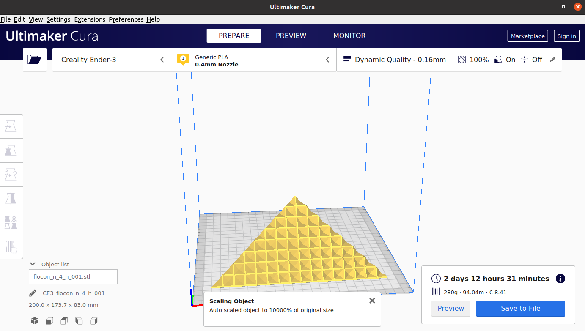

Choose the scaling that's right for you ... remember if you print 2x smaller the output will be 8x faster ... or be patient! Note that you can change the thickness of the triangles if you want, by opening the file [`flocon_3d_imprimable.scad`](source/flocon_3d_imprimable.scad) in OpenSCAD and changing the` h` parameter.

Here are some pictures of the 3D printing:


| After 10 minutes | After 2 hours | One day later | Two days later |
| --- | --- | --- | --- |
| 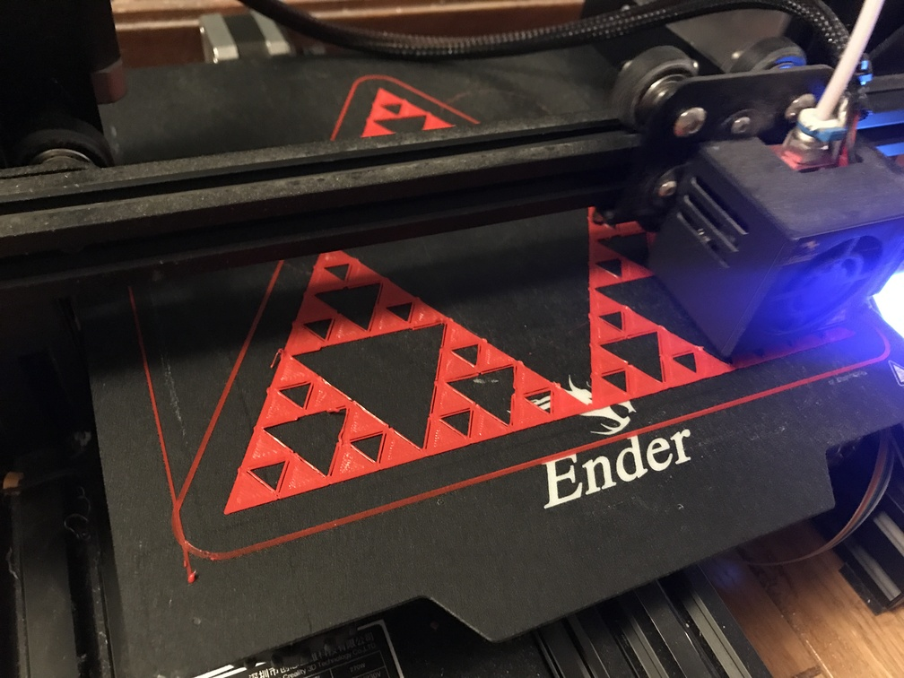 | 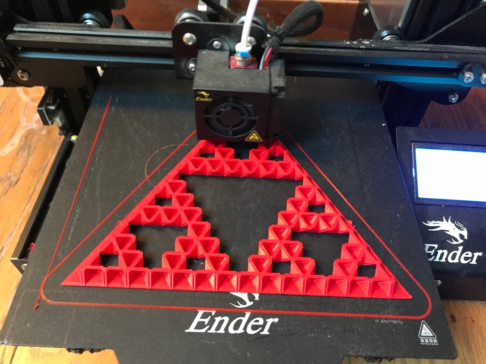 | 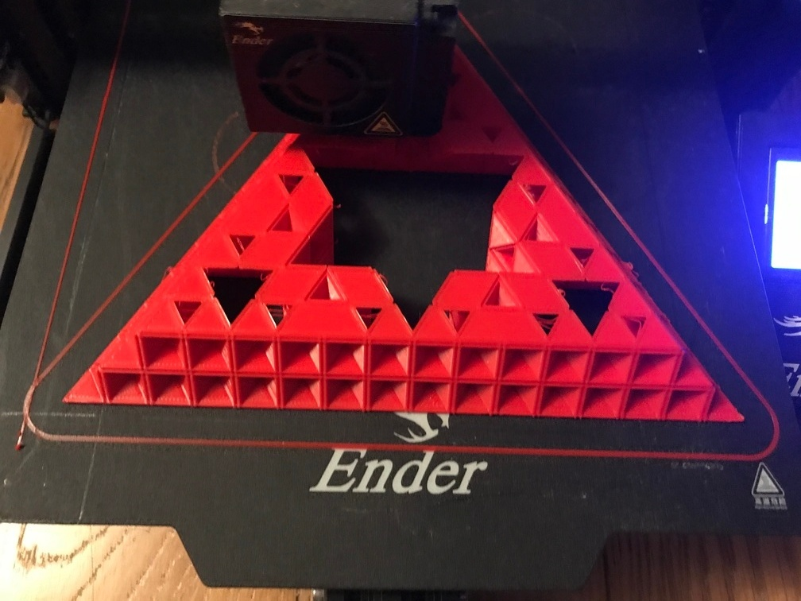 | 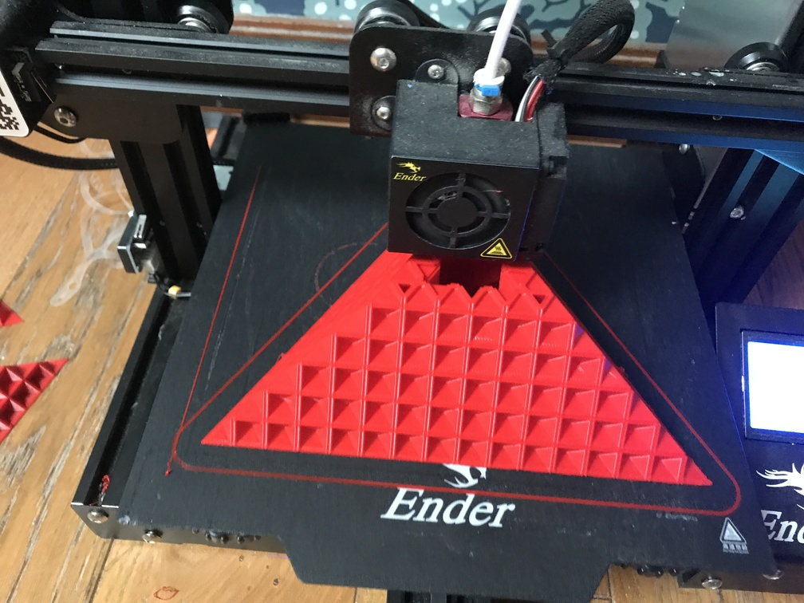 |

We preferred to print _without support_, as extracting the print material seemed almost impossible given the fractal nature of our snowflake. The downside is that the impression is not perfect ... the threads thrown above the void sometimes hang a little.

We have printed several models, modulating the size so that the base triangle is always the same size:

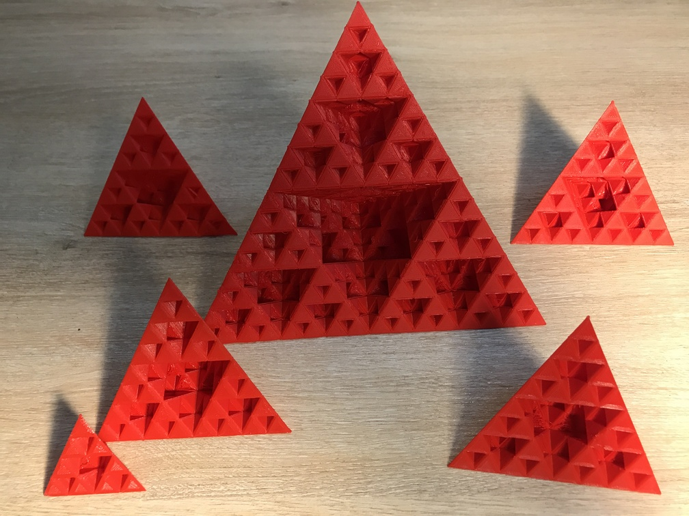

## What to do with these Snowflakes?

We found a lot of games to make with these snowflakes!

### Let's finish the Snowflake!

We only printed the _faces_ of the snowflake. Remember that the starting shape is a tetrahedron, not a triangle ... So let's take four faces, and put them together. Surprise!! We get a CUBE!

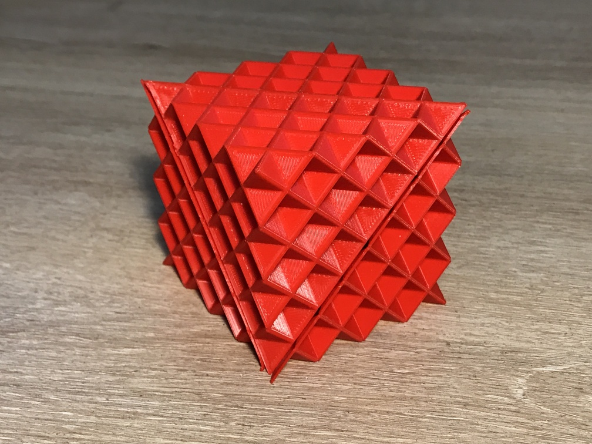


### Russian Dolls

The small snowflakes hide in the big ones:


### The Recurrence

With six small model faces, the large model can be reproduced. It's like in our OpenSCAD program!


### The pyramid

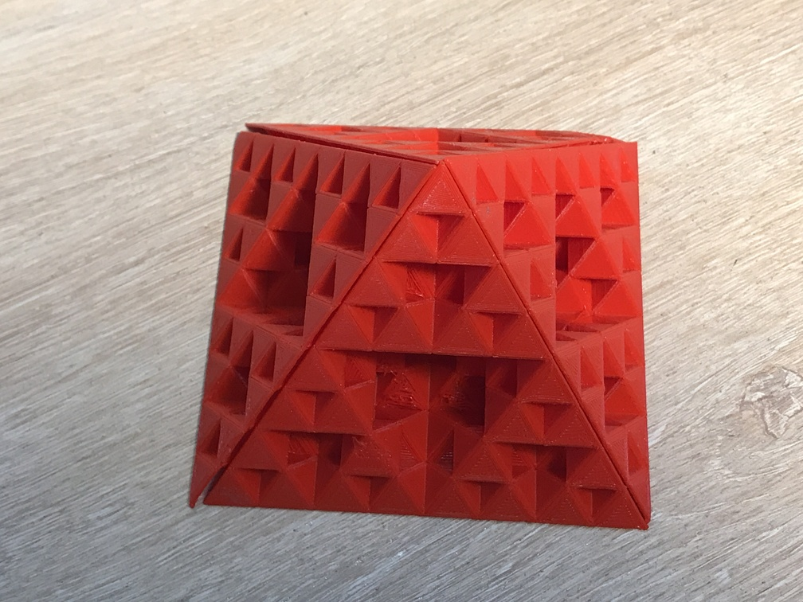

### Hats

The snowflakes also inspired our very young 3-year-old milliner:

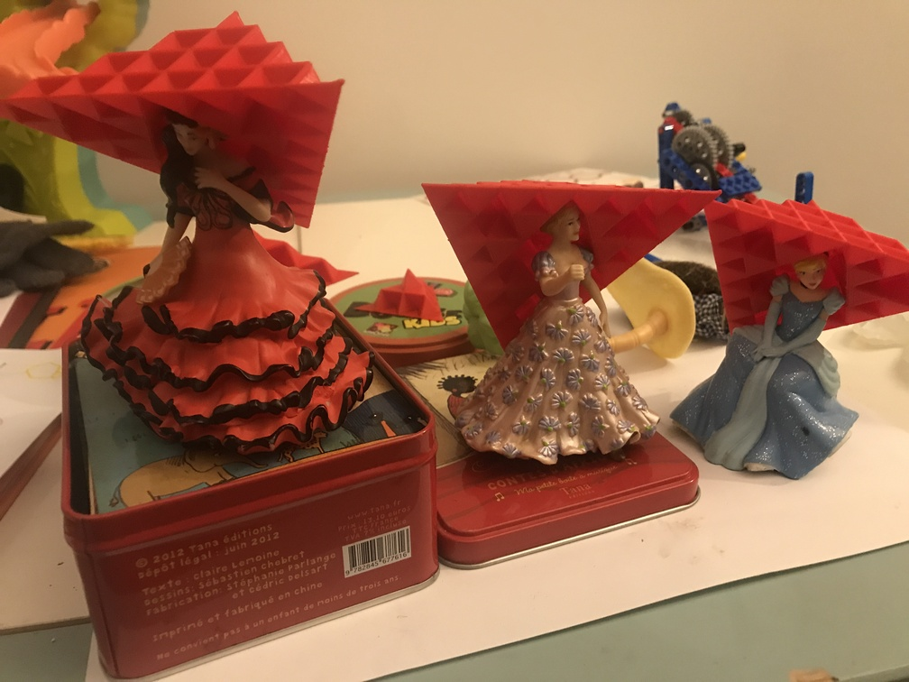

Thank you for accompanying us throughout this article ... see you soon for other fun discoveries with the Wouts family!

***THE END***
