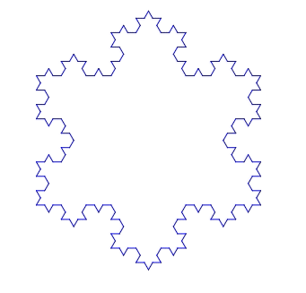
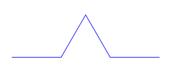
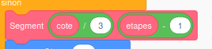
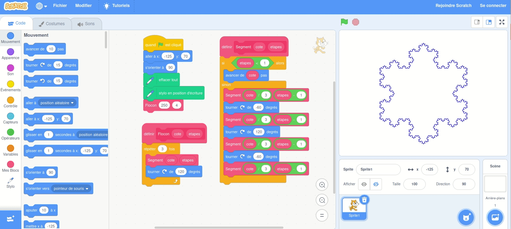

[](http://creativecommons.org/licenses/by-nc-sa/4.0/)

# Le Flocon de Von Koch, de la 2D à la 3D

Sommaire
- Flocon de Von Koch
- La programmation avec Scratch
- Des mathématiques amusantes (une courbe de longueur infinie?)
- Et si on passait à la 3D?

## Le Flocon de Von Koch

Pour dessiner le Flocon de Von Koch, on commence par dessiner un triangle équilatéral:  


Ensuite, on découpe chaque côté du triangle en trois sous-segments égaux. Et on colle un triangle équilatéral, trois fois plus petit que le premier, sur chaque segment central:  


Effaçons maintenant le segment central. Autrement dit, on a remplacé le segment central par deux nouveaux segments, de même longueur, qui font un angle de 60° avec le segment initial:  


On peut recommencer l'opération! Nous avons maintenant 12 segments. Découpons-les chacun en 3, et remplaçons chacun des segments centraux par deux nouveaux segments. Cela nous fait donc 48 segments, n'est-ce pas?  


Et ainsi de suite: voici un flocon avec 192 segments:  


N'ayons peur de rien... voici des flocons avec 768 ou même 3072 ou 12288 côtés... mais ça devient un peu long à dessiner, n'est-ce pas?  
  

### Quel est le périmètre du Flocon?

Imaginons que le triangle initial ait des côtés de longueur 7.29cm, par exemple.
A chaque étape, le nombre de côtés du flocon est multiplié par 4, et chacun des côtés devient 3x plus court.

|                    | Triangle | Flocon 1 | Flocon 2 | Flocon 3 | Flocon 4 | Flocon 5 | Flocon 6 |
| ------------------ | -------- | -------- | -------- | -------- | -------- | -------- | -------- |
|                    |  |  |  |  |  |  |  |
| Nombre de côtés    | 3 | 12 | 48 | 192 | 768 | 3072 | 12288 |
| Longueur d'un côté | 7.29cm | 2.43cm | 0.81cm | 0.27cm | 0.09cm | 0.03cm | 0.01cm |
| Périmètre total    | 21.87cm | 29.16cm | 38.88cm | 51.84cm | 69.12cm | 92.16cm | 122.88cm |

Chaque fois qu'on augmente le flocon d'un degré, le périmètre est multiplié par 4/3. Ce qui signifie que l'on peut le multiplier ainsi à l'infini...ce qui, évidemment, prends aussi un temps infini!

### Et quelle est son aire?

On peut calculer l'aire du Flocon à chaque étape. A chaque opération, on ajoute des triangles qui sont ont un côté trois fois plus petit que les triangles du niveau précédent, et qui ont donc une aire 9 fois plus petite. Et le nombre de ces nouveaux triangles est égal au nombre de segments du Flocon, qui est multiplé par 4 à chaque étape.

Comme le calcul est un peu laborieux, nous avons écrit un petit programme pour faire ce calcul:
```python
import math


def surface_du_flocon(surface_du_triangle, etapes_max):
    # Initialisation: le triangle
    surface_du_flocon = surface_du_triangle
    nombre_de_cotes = 3
    for etape in range(0, etapes_max + 1):
        print(f"Flocon de degré {etape}: {nombre_de_cotes} côtés, {surface_du_flocon} cm2")

        # Aire du flocon de degré supérieur
        surface_du_triangle /= 9
        surface_du_flocon += surface_du_triangle * nombre_de_cotes
        nombre_de_cotes *= 4


cote_du_triange = 7.29
surface_du_triangle = math.sqrt(3) / 4 * cote_du_triange ** 2

surface_du_flocon(surface_du_triangle, 120)
```

Ce qui donne:
```
Flocon de degré 0: 3 côtés, 23.01207033063029 cm2
Flocon de degré 1: 12 côtés, 30.68276044084039 cm2
Flocon de degré 2: 48 côtés, 34.09195604537821 cm2
Flocon de degré 3: 192 côtés, 35.60715409183946 cm2
Flocon de degré 4: 768 côtés, 36.280575445822244 cm2
Flocon de degré 5: 3072 côtés, 36.57987382537014 cm2
Flocon de degré 6: 12288 côtés, 36.712895327391436 cm2
```

On peut faire tourner le programme plus longtemps, et on voit que l'aire augmente de moins en moins vite! Et même, au bout d'un moment le programme donne toujours le même chiffre. L'aire continue à augmenter, mais on ne le voit plus sur le calcul car le programme n'affiche pas assez de décimales...
```
Flocon de degré 118: 331283824645947061796868281389297221717653230664178554647801162742366208 côtés, 36.81931252900848 cm2
Flocon de degré 119: 1325135298583788247187473125557188886870612922656714218591204650969464832 côtés, 36.81931252900848 cm2
Flocon de degré 120: 5300541194335152988749892502228755547482451690626856874364818603877859328 côtés, 36.81931252900848 cm2
```

## Dessiner le Flocon de Von Koch avec Scratch

Scratch est un super projet du Massachusetts Institute of Technology (MIT). C'est un language de programmation visuel et très facile à utiliser, même pour les enfants. Vous pouvez essayer Scratch directement sur le [site du MIT](https://scratch.mit.edu/projects/editor/), sans rien installer!

### Commençons par un triangle

Avant de dessiner le Flocon, on va utiliser Scratch pour dessiner un triangle équilatéral. 
Le programme est assez simple: on demande au personnage d'avancer de 250 unités, puis de changer de direction, et cela à trois reprises:


Vous avez remarqué, n'est-ce pas, qu'on demande au personnage de changer de direction suivant un angle de 120°... avouons qu'on a commencé par essayer 60°, mais alors on obtient un hexagone et pas un triangle... cela parce que l'angle correspond au changement de direction, et non pas à l'angle fait par les deux segments...

Si vous voulez essayer vous même le programme qui dessine le triangle, il est disponible dans le dossier `scratch` de ce projet.

### A nous le flocon!

Pour programmer le flocon, voyons quelle trajectoire le personnage de Scratch va devoir suivre. Chaque segment du triangle va être remplacé par une suite de 4 segments:



- traçons un segment de longueur 3 fois plus petite que le segment initial
- puis, tournons de 60° dans le sens inverse des aiguilles d'une montre pour commencer à dessiner le triangle qu'on va ajouter
- traçons un segment
- tournons de 120° dans le sens des aiguilles pour dessiner la pointe du nouveau triangle
- traçons un segment
- tournons à nouveau de 60° dans le sens inverse
- et traçons le dernier segment.

Pour le triangle, nous avions déjà utilisé un _block_ dans scratch. Ici, on remplace l'instruction "avancer de 250 pas" qu'on avait pour le triangle par "faire un segment de longueur 250 pas dans la direction actuelle". Et ce block "faire un segment" va lui-même faire les 4 segments que nous avons décrit plus haut... Autrement dit il va appeler 4 fois le même block!


Bien sûr, il faut faire attention de ne pas appeler le même block indéfiniment, sinon le programme ne terminerait jamais! Donc, dans notre programme, on demande au sous segment d'être
- trois fois plus court
- et de faire une étape de moins



Nous sommes prêts! D'ailleurs, si vous voulez essayer avec nous, le programme est aussi disponible dans le dossier `scratch`  - c'est le fichier [`flocon.sb3`](scratch/flocon.sb3)




