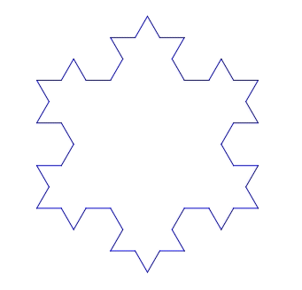
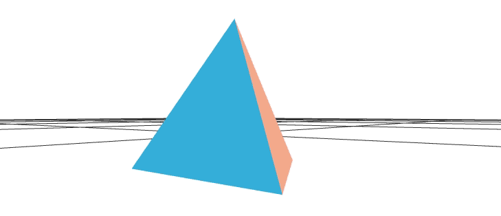
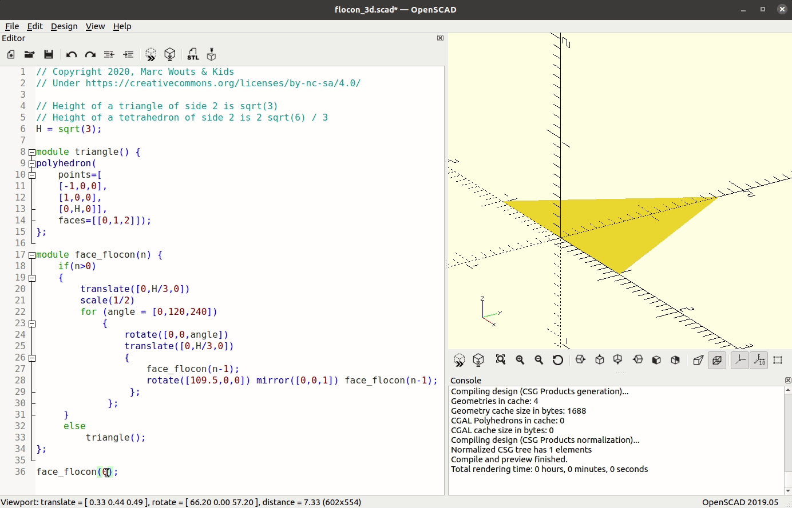
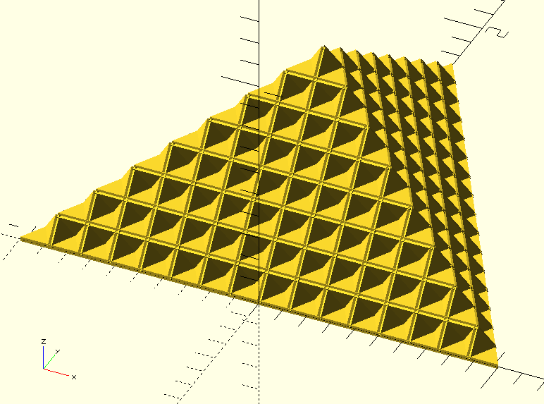
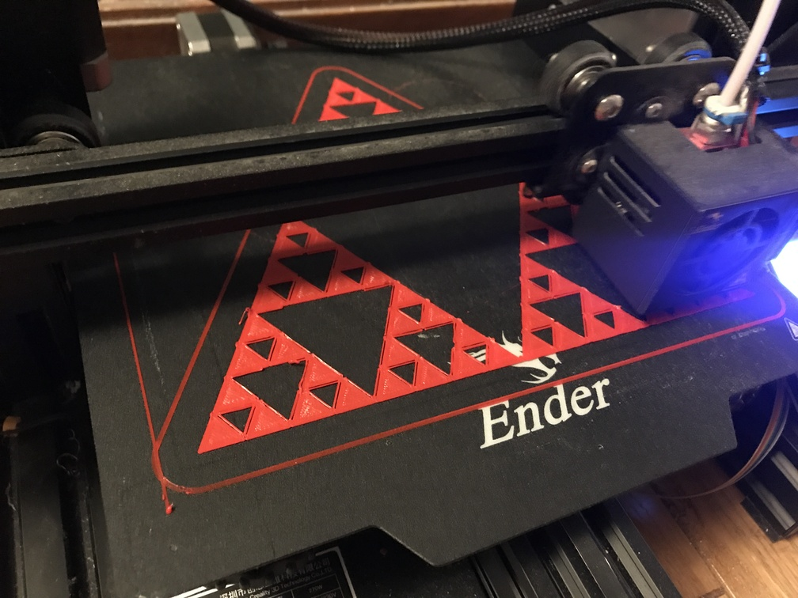
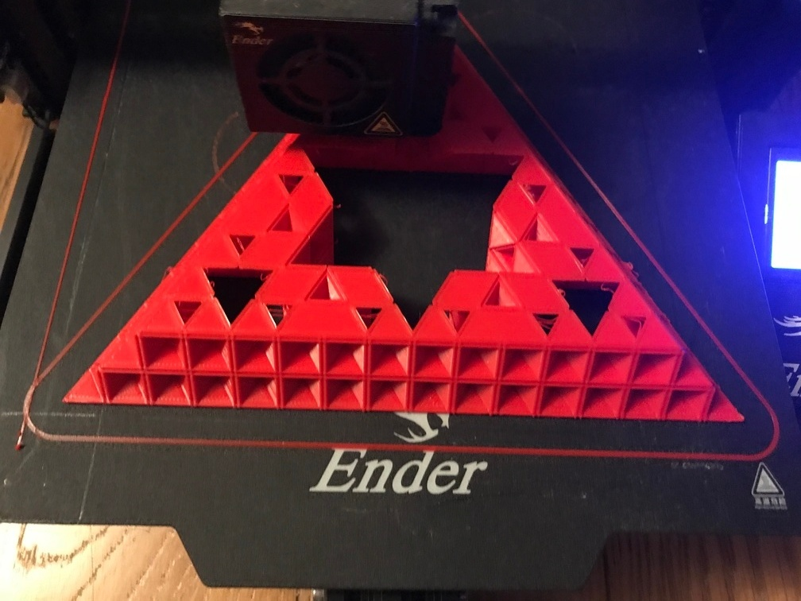
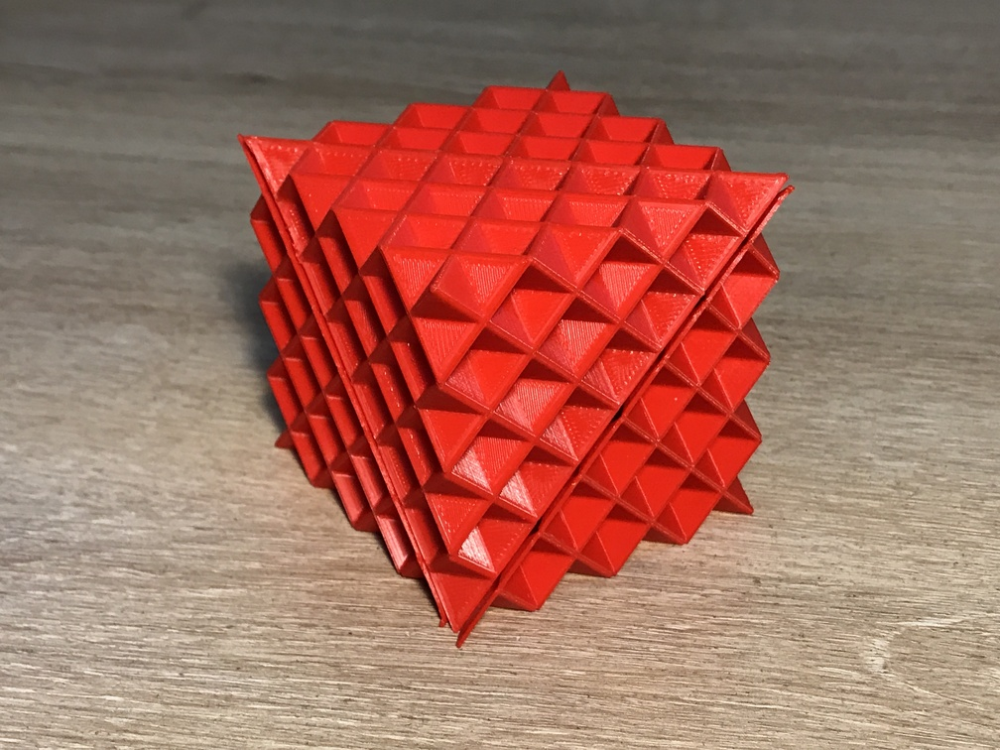
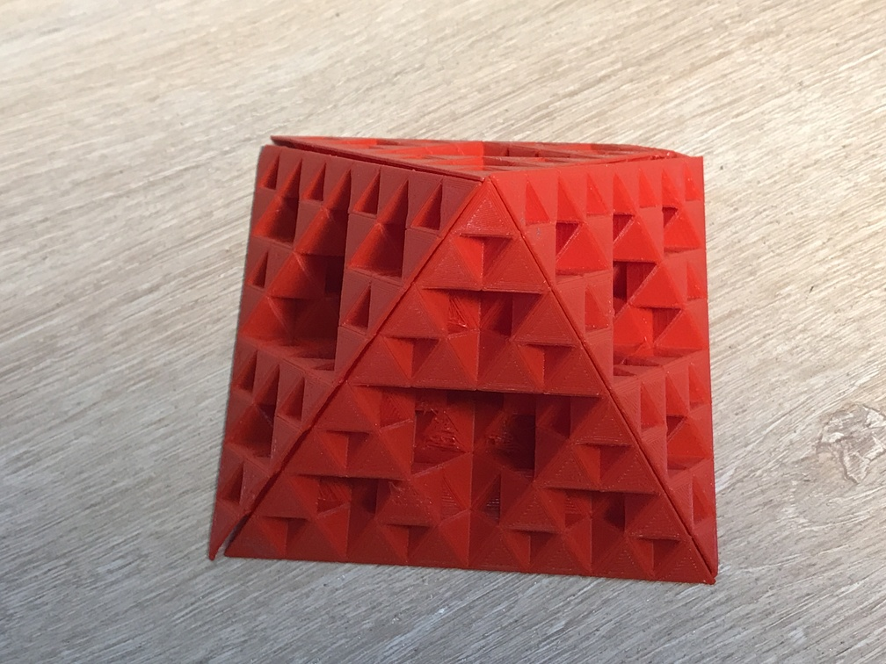

[](http://creativecommons.org/licenses/by-nc-sa/4.0/)

# Le Flocon de Koch en Trois Dimensions - Des Fractales Amusantes à la Maison

Bienvenue! Ceci est un article que nous écrivons à six mains: Marc, le Papa, mathématicien et un peu bricoleur à ses heures, Sasha, 12 ans, et Félix, 8 ans. Nous avons commencé par explorer quelques concepts mathématiques à partir du Flocon de Koch, chacun y a apporté beaucoup d'enthousiasme et nous sommes finalement allés beaucoup plus loin que prévu... jusqu'à la programmation en Scratch, l'impression 3D, et finalement l'écriture de cet article. Autant dire que nous avons passé de supers moments sur ce projet... et nous souhaitons maintenant vous en faire profiter!

**Sommaire**
- [Le Flocon de Koch](#le-flocon-de-koch)
  - [Dessiner le Flocon](#dessiner-le-flocon)
  - [Un peu d'Arithmétique](#un-peu-darithmtique)
  - [Dessiner le Flocon avec Scratch](#dessiner-le-flocon-avec-scratch)
- [Et si on passait à la 3D?](#et-si-on-passait--la-3d)
  - [Le Tétraèdre](#le-ttradre)
  - [Le Flocon en 3D - Etape 1](#le-flocon-en-3d---etape-1)
  - [Le Flocon en 3D - Récurrence](#le-flocon-en-3d---rcurrence)
  - [Imprimer le Flocon](#imprimer-le-flocon)
  - [Que faire avec ces Flocons?](#que-faire-avec-ces-flocons)
  
# Le Flocon de Koch

## Dessiner le Flocon

Le [Flocon de Koch](https://fr.wikipedia.org/wiki/Flocon_de_Koch) est une forme très connue chez les mathématiciens! Il est facile à dessiner, il a des propriétés mathématiques très amusantes: son périmètre est infini, alors que son aire reste finie, et surtout c'est un bel exemple de [fractale](https://fr.wikipedia.org/wiki/Fractale): les parties du flocon ressemblent au flocon lui-même... en plus petit!

Commençons par dessiner le flocon. On part d'un triangle équilatéral. Ensuite, on découpe chaque côté du triangle en trois sous-segments égaux. Et on colle un triangle équilatéral, trois fois plus petit que le premier, sur chacun des segments centraux.

Effaçons maintenant les segments centraux. Autrement dit, on a remplacé chaque segment central par deux nouveaux segments, de même longueur, qui font un angle de 60° avec le segment initial:  
| Triangle | Ajoutons des petits triangles | Gommons le segment intérieur |
| --- | --- | --- |
|  |  |   |

On peut recommencer l'opération! Nous avons maintenant 12 segments. Découpons-les chacun en 3, et remplaçons chacun des segments centraux par deux nouveaux segments. Cela nous fait donc 48 segments, n'est-ce pas? Et ainsi de suite!

| 48 segments | 192 segments |
| --- | --- |
|  |  |

N'ayons peur de rien... voici des flocons avec 768 ou même 3072 ou 12288 côtés... mais ça devient un peu long à dessiner...
| 768 | 3072 | 12288 |
| --- | --- | --- |
|  |  |  |

## Un peu d'Arithmétique

Le Flocon de Koch est très connu pour ses propriétés mathématiques. A chaque étape, son périmètre et son aire augmentent... mais pas dans les mêmes proportions!

Imaginons que le triangle initial ait des côtés de longueur 7.29cm (nous pourrons diviser 7.29 de nombreuses fois par 3, d'où ce choix!) A chaque étape, le nombre de côtés du flocon est multiplié par 4, et chacun des côtés devient 3x plus court.

|                    | Triangle | Flocon 1 | Flocon 2 | Flocon 3 | Flocon 4 | Flocon 5 | Flocon 6 |
| ------------------ | -------- | -------- | -------- | -------- | -------- | -------- | -------- |
|                    |  |  |  |  |  |  |  |
| Nombre de côtés    | 3 | 12 | 48 | 192 | 768 | 3072 | 12288 |
| Longueur d'un côté | 7.29cm | 2.43cm | 0.81cm | 0.27cm | 0.09cm | 0.03cm | 0.01cm |
| Périmètre total    | 21.87cm | 29.16cm | 38.88cm | 51.84cm | 69.12cm | 92.16cm | 122.88cm |

Chaque fois qu'on augmente le flocon d'un degré, le périmètre est multiplié par 4/3. Ce qui signifie que l'on peut le multiplier ainsi à l'infini...ce qui, évidemment, prends aussi un temps infini!

Le périmètre va dépasser (et rester au delà) de n'importe quelle valeur. Par exemple:
- Il dépasse le mètre à l'étape 6
- le kilomètre à l'étape 30
- et même l'année lumière à l'étape 134!

Les mathématiciens disent dans ce cas que le périmètre _tend vers l'infini_.

Et l'aire du Flocon? 

Et bien, on peut la calculer. A chaque opération, on ajoute des triangles qui sont ont un côté trois fois plus petit que les triangles du niveau précédent, et qui ont donc une aire 9 fois plus petite. Et le nombre de ces nouveaux triangles est égal au nombre de segments du Flocon, qui est multiplé par 4 à chaque étape.

Comme le calcul est un peu laborieux, nous avons écrit un petit programme:
```python
import math


def surface_du_flocon(surface_du_triangle, etapes_max):
    # Initialisation: le triangle
    surface_du_flocon = surface_du_triangle
    nombre_de_cotes = 3
    for etape in range(0, etapes_max + 1):
        print(f"Flocon de degré {etape}: {nombre_de_cotes} côtés, {surface_du_flocon} cm2")

        # Aire du flocon de degré supérieur
        surface_du_triangle /= 9
        surface_du_flocon += surface_du_triangle * nombre_de_cotes
        nombre_de_cotes *= 4


cote_du_triange = 7.29
surface_du_triangle = math.sqrt(3) / 4 * cote_du_triange ** 2

surface_du_flocon(surface_du_triangle, 120)
```

Ce qui donne:
```
Flocon de degré 0: 3 côtés, 23.01207033063029 cm2
Flocon de degré 1: 12 côtés, 30.68276044084039 cm2
Flocon de degré 2: 48 côtés, 34.09195604537821 cm2
Flocon de degré 3: 192 côtés, 35.60715409183946 cm2
Flocon de degré 4: 768 côtés, 36.280575445822244 cm2
Flocon de degré 5: 3072 côtés, 36.57987382537014 cm2
Flocon de degré 6: 12288 côtés, 36.712895327391436 cm2
```

On peut faire tourner le programme plus longtemps, et on voit que l'aire augmente de moins en moins vite! Et même, au bout d'un moment le programme donne toujours le même chiffre: `36.81931252900848 cm2`. L'aire continue à augmenter, mais on ne le voit plus car le programme n'affiche pas assez de décimales...
```
Flocon de degré 118: 331283824645947061796868281389297221717653230664178554647801162742366208 côtés, 36.81931252900848 cm2
Flocon de degré 119: 1325135298583788247187473125557188886870612922656714218591204650969464832 côtés, 36.81931252900848 cm2
Flocon de degré 120: 5300541194335152988749892502228755547482451690626856874364818603877859328 côtés, 36.81931252900848 cm2
```

Les mathématiciens disent que l'aire _converge_, et il savent même calculer la valeur de la limite, égale à `2a²√3/5=36.819312529008464...`, cf. l'article en anglais sur le [Flocon de Koch](https://en.wikipedia.org/wiki/Koch_snowflake) sur Wikipedia.

Le flocon de Koch est donc un exemple de forme avec une aire finie, et un périmètre infini!

## Programmer le Flocon en Scratch

C'est Félix qui nous a fait découvrir Scratch! Scratch est un super projet du Massachusetts Institute of Technology (MIT). C'est un language de programmation très accessible pour les enfants. Les instructions sont très visuelles. Vous pouvez essayer Scratch directement sur le [site du MIT](https://scratch.mit.edu/projects/editor/), sans rien installer!

### Commençons par un Triangle

Avant de dessiner le Flocon, on va utiliser Scratch pour dessiner un triangle équilatéral. 
Le programme est assez simple: on fait avancer puis tourner le personnage, et cela à trois reprises:


Vous avez remarqué, n'est-ce pas, qu'on fait tourner le personnage d'un angle de 120°, et non pas 60°... avouons qu'on a commencé par essayer 60°, mais alors on obtenait un hexagone et pas un triangle. Cela parce que l'angle doit être le changement de direction, et non pas l'angle fait par les deux segments!

Si vous voulez essayer vous même le programme qui dessine le triangle, il est disponible dans le dossier [`scratch`](scratch) de ce projet - c'est [`triangle.sb3`](scratch/triangle.sb3).

### A nous le Flocon!

Pour programmer le flocon, voyons quelle trajectoire le personnage de Scratch va devoir suivre. Chaque segment du triangle va être remplacé par une suite de 4 segments:


Faisons l'exercice de décrire cette trajectoire:
- on trace un segment de longueur 3 fois plus petite que le segment initial
- puis, on tourne de 60° dans le sens inverse des aiguilles d'une montre
- on trace un autre segment
- on tourne de 120° dans le sens des aiguilles d'une montre
- avant de dessiner le troisième segment
- enfin, on tourne de 60° dans le sens inverse
- et on trace le dernier segment.

Pour le triangle, nous avions déjà utilisé un _bloc_ dans scratch. Ici, on remplace l'instruction "avancer de 250 pas" qu'on avait pour le triangle par "faire un segment de longueur 250 pas dans la direction actuelle". Et ce bloc "faire un segment" va lui-même faire les 4 segments que nous avons décrit plus haut... Autrement dit il va appeler 4 fois le même bloc!


Bien sûr, il faut faire attention à ne pas appeler le même bloc indéfiniment, sinon le programme ne se terminerait jamais! Donc, dans notre programme, on demande au sous segment d'être
- trois fois plus court
- et de faire une étape de moins


Nous sommes prêts! D'ailleurs, si vous voulez essayer avec nous, le programme est aussi disponible dans le dossier [`scratch`](scratch)  - c'est le fichier [`flocon.sb3`](scratch/flocon.sb3).


# Et si on passait à la 3D?

Le Flocon de Koch en 2D est super sympa... êtes-vous curieux de voir ce que ça donne en 3D?

## Le Tétraèdre

En trois dimensions, l'équivalent du triangle est le tétraèdre. C'est le polyèdre régulier dont les 4 faces sont des triangles équilatéraux.

On a commencé par construire le tétraèdre avec [OpenSCAD](https://www.openscad.org/).

Dans OpenSCAD, on créé le tétraèdre en donnant les coordonnées de tous les points, puis en énumérant tout les faces. Le code s'écrit

```
H = sqrt(3);         // C'est la hauteur d'un triangle équilatéral de côté 2
T = 2 * sqrt(6) / 3; // C'est la hauteur d'un tétraèdre régulier de côté 2

polyhedron(
    // Les 4 sommets du tétraèdre
    points=[
        // 4 points avec à chaque fois les trois coordonnées: x, y, z
        [-1,0,0], [1,0,0], [0,H,0], [0,H/3,T]
        ],
    
    // Les 4 triangles qui forment le tétraèdre
    faces=[
        // 4 faces qui relient chacune 3 sommets (les 4 sommets sont numérotés de 0 à 3)
        [0,1,2], [3,2,1], [3,1,0], [3,0,2]
        ]
    );
```

Comment a-t-on déterminé les coordonnées des sommets?
- Nous avons d'abord placé les deux premiers sommets sur l'axe `x`, aux coordonnées `-1` et `+1`. Notre tétraèdre aura donc un côté égal à 2.
- Puis nous avons cherché la [hauteur du triangle équilatéral](https://fr.wikipedia.org/wiki/Triangle_%C3%A9quilat%C3%A9ral) sur Wikipedia. La hauteur est égale à `√3/2` fois le côté. Nous plaçons donc le troisième sommet à `y=√3`.
- Le sommet du tétraèdre est au dessus du centre de gravité du triangle horizontal, au tiers de la hauteur du triangle. Il aura donc pour coordonnée `y=√3/3`. 
- Enfin, Wikipedia nous dit que la [hauteur du tétraèdre](https://fr.wikipedia.org/wiki/T%C3%A9tra%C3%A8dre) est égale à `√6/3` fois son côté. Nous choisissons donc `z=2√6/3` pour ce point.

Dans OpenSCAD, on execute le code avec F5 (preview), et on obtient ceci:


OpenSCAD permet aussi d'exporter les fichiers 3D au format STL (F6 puis F7). Vous pourrez retrouver notre tétraèdre au format STL [ici](stl/tetrahedron.stl), et le visualiser en 3D sur GitHub, ou même l'imprimer en 3D !

[](stl/tetrahedron.stl)

## Le Flocon en 3D - Etape 1

Rappelez-vous: pour avancer d'une étape la construction du flocon de Koch en deux dimensions, il fallait ajouter un triangle de côté égal au tiers du segment, à chaque segment.

En trois dimensions nous allons tenter la même approche. A chaque triangle équilatéral, nous allons ajouter un nouveau tétraèdre!

Faisons le pour une seule face: nous allons obtenir un total de six triangles équilatéraux.  


La question, c'est... comment allons-nous programmer ça?

Etudions le programme ci-dessous:
```
H = sqrt(3);

module triangle() {
polyhedron(
    points=[[-1,0,0], [1,0,0], [0,H,0]],
    faces=[[0,1,2]]);
};

translate([0,H/3,0])
scale(1/2)
for (angle = [0,120,240])
{
    rotate([0,0,angle])
    translate([0,H/3,0])
    {   
        triangle();
        rotate([109.5,0,0]) mirror([0,0,1]) triangle();
    };
};
```

- Avec le module `triangle`, on définit une fonction capable de tracer un triangle de côté égal à 2. C'est la base du tétraèdre précédent.
- Pour tracer les 6 triangles, nous utilisons une boucle qui nous fait tourner dans l'espace, de 0, 120 ou 240°: ce sont les instructions `for (angle = [0,120,240])` et `rotate([0,0,angle])`
- Nous voulons que chacun de ces 6 triangles soit 2x plus petit que le triangle d'origine, d'où l'instruction `scale(1/2)` qui réduit l'échelle d'un facteur 2.
- Enfin, la figure doit avoir le même centre de gravité (dans le plan `(x,y)`), d'où l'instruction `translate([0,H/3,0])` qui nous positionne sur ce point avant de faire les rotations
- Finalement, on trace deux triangles (et cela, à trois reprises, grace à la boucle `for`) à une distance `H/3` du centre de rotation, d'où la seconde instruction `translate([0,H/3,0])`. Le premier triangle est dans le plan d'origine. L'autre fait un angle de 109.5° par rapport à ce plan. On a trouvé cet angle par _dichotomie_: si on met une valeur plus petite, le tétraèdre central est ouvert, et s'il est plus grand, les triangles se recoupent... La valeur exacte est sans doute un peu différente - c'est peut-être l'angle [_Vertex-Center-Vertex_](https://en.wikipedia.org/wiki/Tetrahedron) égal à `2 arctan(√2)=109.4712...` d'après Wikipedia.

## Le Flocon en 3D - Récurrence

Pour itérer les étapes du Flocon en 3D, on va remplacer l'appel à `triangle()` par un appel à `face_flocon(n-1)`. Le fichier correspondant est disponible à [`flocon_3d.scad`](source/flocon_3d.scad) dans le dossier [`source`](source).

Ouvrez-le fichier dans OpenSCAD, et changez la valeur dans `face_flocon(3)` à la dernière ligne, puis appuyez sur F5. 
Faites attention à ne pas mettre de trop grandes valeurs... Rappelez-vous que pour `n=0` on a un seul triangle, mais qu'à chaque étape on en créé six fois plus, autrement dit pour `n=5` on aura déjà 7776 triangles... au delà, la croissance exponentielle des triangles risque fort d'avoir raison de OpenSCAD, voire même de bloquer votre ordinateur.



Avez-vous comme nous trouvé le résultat un peu décevant? La surface du Flocon en 3D converge vers une forme très simple... un tétraèdre irrégulier (d'une hauteur égale à la moitié de la hauteur du tétraèdre régulier). Pour vérifier qu'on ne s'était pas trompé on a encore utilisé [Wikipedia](https://fr.wikipedia.org/wiki/Flocon_de_Koch).

Regardons par exemple la face du Flocon 3D avec `n=4`:

[](stl/face_flocon_4.stl)

Un peu trop régulier pour une fractale, n'est-ce pas?

En fait, le côté fractal du flocon 3D apparaît seulement lorsqu'on le retourne! N'hésitez pas à cliquer sur l'image pour interagir vous-même avec le fichier 3D.  

[](stl/face_flocon_4.stl)

## Imprimer le Flocon

Nous avons découvert l'impression 3D pendant le premier confinement... C'est très simple: l'imprimante construit progressivement la forme demandée en faisant fondre un fil de plastique. C'est génial... mais bon, c'est un peu lent... et pas toujours facile à régler!

Dans le cas du Flocon 3D, le premier problème que nous avons rencontré, c'est que notre Flocon faisait 0 grammes... autrement dit, l'imprimante n'imprimait rien du tout!

Vous allez rencontrer le même problème si vous tentez d'imprimer les fichier STL que nous avons générés jusqu'à présent. En effet, nos fichiers STL décrivent uniquement une _surface_, et non pas un _volume_. 

Si on veut vraiment imprimer le Flocon, il va falloir lui donner un peu d'épaisseur, et remplacer la forme de base, i.e. le `triangle()`, par un volume qui _ressemblera_ au triangle mais qui aura un peu de matière.

Nous avons fait cela avec la fonction suivante:
```
module triangle_epais(h) {
polyhedron(
    points=[
    [-1,0,h], [1,0,h], [0,H,h],
    [-1,0,-h], [1,0,-h], [0,H,-h]],
    // sommets dans l'ordre des aiguilles d'une montre vu de l'extérieur
    faces=[[0,1,2], [1,0,3,4], [2,1,4,5], [0,2,5,3], [5,4,3]]);
};
```
dans le fichier [`flocon_3d_imprimable.scad`](source/flocon_3d_imprimable.scad). Notez que, pour éviter que les triangles deviennent trop fins lorsqu'on applique la récursion, nous multiplions l'argument `h` par 2 à chaque étape, pour compenser le changement d'échelle. Le résultat est la forme suivante:  



Vous pouvez générer vous-même les fichiers STL (F5, F6 puis F7 dans OpenSCAD, ça prend un certain temps déjà pour `n=4`) ou bien les récupérer dans le dossier [`stl_imprimables`](stl_imprimables).

Pour imprimer, ouvrez le fichier dans [Cura Ultimaker](https://ultimaker.com/fr/software/ultimaker-cura):  


Choisissez la mise à l'échelle qui vous convient... souvenez-vous que si vous imprimez 2x plus petit, le résultat sera 8x plus rapide... ou bien armez-vous de patience! Notez que vous pouvez modifier l'épaisseur des triangles si vous le souhaitez, en ouvrant le fichier [`flocon_3d_imprimable.scad`](source/flocon_3d_imprimable.scad) dans OpenSCAD et en changeant le paramètre `h`.

Voici quelques images de l'impression 3D:  


| Après 10 minutes | Après 2 heures | Un jour plus tard | Deux jours plus tard |
| --- | --- | --- | --- |
|  |  |  |  |

Nous avons préféré imprimer _sans support_, car extraire le support d'impression semblait quasiment impossible vu la nature fractale de notre flocon. L'inconvénient, c'est que l'impression n'est pas parfaite... les fils lancés au dessus du vide pendent parfois un peu.

Nous avons imprimé plusieurs modèles, en modulant la taille de façon à ce que le triangle de base ait toujours la même taille:  


## Que faire avec ces Flocons?

Nous avons trouvé beaucoup de jeux à faire avec ces pièces!

### Finissons le Flocon!

Nous n'avons imprimé que les _faces_ du flocon. Souvenez-vous que la forme de départ est un tétraèdre, non un triangle... Prenons donc quatre faces, et assemblons-les. Surprise!! On obtient un CUBE!




### Les Poupées Russes

Les petits flocons se cachent dans les grands:  


### La Récurrence Recommencée

Avec six faces petit modèle, on peut reproduire le grand modèle. C'est comme dans notre programme OpenSCAD!


### La Pyramide



### Les Chapeaux

Les flocons ont également inspiré notre très jeune modiste de 3 ans:  


Merci de nous avoir accompagné tout au long de cet article... à bientôt pour d'autres découvertes amusantes avec la famille Wouts!

***FIN***
