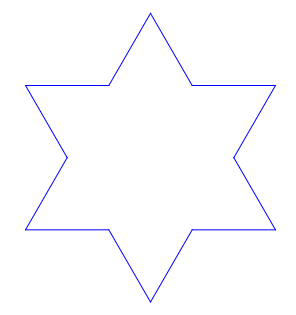
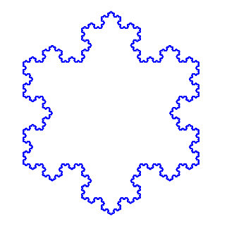
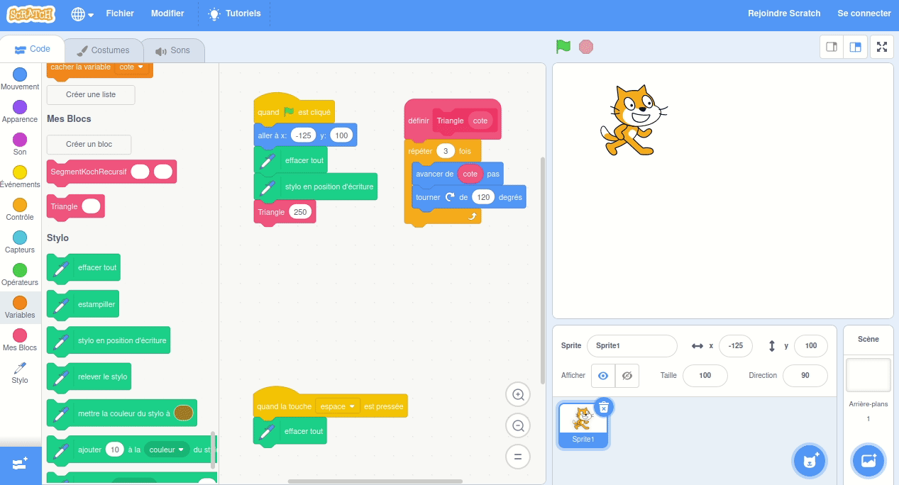
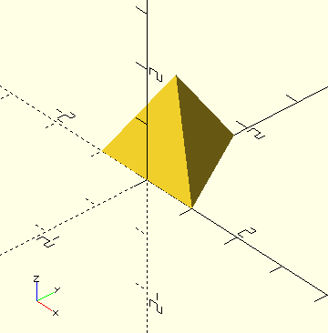
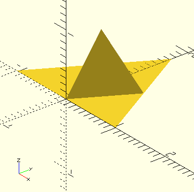
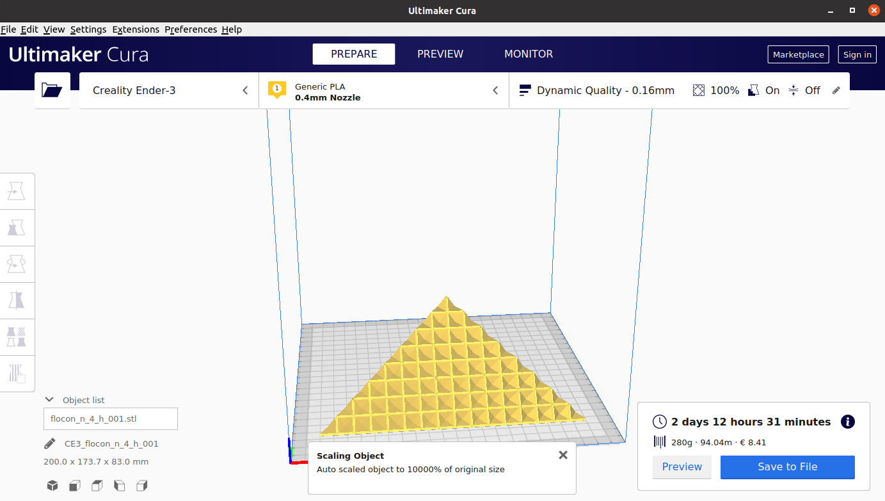

[](http://creativecommons.org/licenses/by-nc-sa/4.0/)

# Le Flocon de Von Koch, de la 2D à la 3D

## Introduction

Bienvenue! Ceci est un article que nous écrivons à six mains: Marc, le Papa, mathématicien et un peu bricoleur à ses heures, et ses enfants de 12 et 8 ans. Nous avons commencé par explorer quelques concepts mathématiques à partir du Flocon de Von Koch, chacun y a apporté beaucoup d'enthousiasme et nous sommes finalement allés beaucoup plus loin que prévu... jusqu'à la programmation en Scratch, l'impression 3D, et finalement l'écriture de cet article. Autant dire que nous avons passé de supers moments sur ce projet... et nous souhaitons maintenant vous en faire profiter!

## Le Flocon de Von Koch

Pour dessiner le Flocon de Von Koch, on commence par dessiner un triangle équilatéral:  


Ensuite, on découpe chaque côté du triangle en trois sous-segments égaux. Et on colle un triangle équilatéral, trois fois plus petit que le premier, sur chaque segment central:  


Effaçons maintenant le segment central. Autrement dit, on a remplacé le segment central par deux nouveaux segments, de même longueur, qui font un angle de 60° avec le segment initial:  


On peut recommencer l'opération! Nous avons maintenant 12 segments. Découpons-les chacun en 3, et remplaçons chacun des segments centraux par deux nouveaux segments. Cela nous fait donc 48 segments, n'est-ce pas?  


Et ainsi de suite: voici un flocon avec 192 segments:  


N'ayons peur de rien... voici des flocons avec 768 ou même 3072 ou 12288 côtés... mais ça devient un peu long à dessiner, n'est-ce pas?  
  

### Quel est le périmètre du Flocon?

Imaginons que le triangle initial ait des côtés de longueur 7.29cm, par exemple.
A chaque étape, le nombre de côtés du flocon est multiplié par 4, et chacun des côtés devient 3x plus court.

|                    | Triangle | Flocon 1 | Flocon 2 | Flocon 3 | Flocon 4 | Flocon 5 | Flocon 6 |
| ------------------ | -------- | -------- | -------- | -------- | -------- | -------- | -------- |
|                    |  |  |  |  |  |  |  |
| Nombre de côtés    | 3 | 12 | 48 | 192 | 768 | 3072 | 12288 |
| Longueur d'un côté | 7.29cm | 2.43cm | 0.81cm | 0.27cm | 0.09cm | 0.03cm | 0.01cm |
| Périmètre total    | 21.87cm | 29.16cm | 38.88cm | 51.84cm | 69.12cm | 92.16cm | 122.88cm |

Chaque fois qu'on augmente le flocon d'un degré, le périmètre est multiplié par 4/3. Ce qui signifie que l'on peut le multiplier ainsi à l'infini...ce qui, évidemment, prends aussi un temps infini!

### Et quelle est son aire?

On peut calculer l'aire du Flocon à chaque étape. A chaque opération, on ajoute des triangles qui sont ont un côté trois fois plus petit que les triangles du niveau précédent, et qui ont donc une aire 9 fois plus petite. Et le nombre de ces nouveaux triangles est égal au nombre de segments du Flocon, qui est multiplé par 4 à chaque étape.

Comme le calcul est un peu laborieux, nous avons écrit un petit programme pour faire ce calcul:
```python
import math


def surface_du_flocon(surface_du_triangle, etapes_max):
    # Initialisation: le triangle
    surface_du_flocon = surface_du_triangle
    nombre_de_cotes = 3
    for etape in range(0, etapes_max + 1):
        print(f"Flocon de degré {etape}: {nombre_de_cotes} côtés, {surface_du_flocon} cm2")

        # Aire du flocon de degré supérieur
        surface_du_triangle /= 9
        surface_du_flocon += surface_du_triangle * nombre_de_cotes
        nombre_de_cotes *= 4


cote_du_triange = 7.29
surface_du_triangle = math.sqrt(3) / 4 * cote_du_triange ** 2

surface_du_flocon(surface_du_triangle, 120)
```

Ce qui donne:
```
Flocon de degré 0: 3 côtés, 23.01207033063029 cm2
Flocon de degré 1: 12 côtés, 30.68276044084039 cm2
Flocon de degré 2: 48 côtés, 34.09195604537821 cm2
Flocon de degré 3: 192 côtés, 35.60715409183946 cm2
Flocon de degré 4: 768 côtés, 36.280575445822244 cm2
Flocon de degré 5: 3072 côtés, 36.57987382537014 cm2
Flocon de degré 6: 12288 côtés, 36.712895327391436 cm2
```

On peut faire tourner le programme plus longtemps, et on voit que l'aire augmente de moins en moins vite! Et même, au bout d'un moment le programme donne toujours le même chiffre. L'aire continue à augmenter, mais on ne le voit plus sur le calcul car le programme n'affiche pas assez de décimales...
```
Flocon de degré 118: 331283824645947061796868281389297221717653230664178554647801162742366208 côtés, 36.81931252900848 cm2
Flocon de degré 119: 1325135298583788247187473125557188886870612922656714218591204650969464832 côtés, 36.81931252900848 cm2
Flocon de degré 120: 5300541194335152988749892502228755547482451690626856874364818603877859328 côtés, 36.81931252900848 cm2
```

## Dessiner le Flocon de Von Koch avec Scratch

Scratch est un super projet du Massachusetts Institute of Technology (MIT). C'est un language de programmation visuel et très facile à utiliser, même pour les enfants. Vous pouvez essayer Scratch directement sur le [site du MIT](https://scratch.mit.edu/projects/editor/), sans rien installer!

### Commençons par un triangle

Avant de dessiner le Flocon, on va utiliser Scratch pour dessiner un triangle équilatéral. 
Le programme est assez simple: on demande au personnage d'avancer de 250 unités, puis de changer de direction, et cela à trois reprises:



Vous avez remarqué, n'est-ce pas, qu'on demande au personnage de changer de direction suivant un angle de 120°... avouons qu'on a commencé par essayer 60°, mais alors on obtient un hexagone et pas un triangle... cela parce que l'angle correspond au changement de direction, et non pas à l'angle fait par les deux segments...

Si vous voulez essayer vous même le programme qui dessine le triangle, il est disponible dans le dossier `scratch` de ce projet.

### A nous le flocon!

Pour programmer le flocon, voyons quelle trajectoire le personnage de Scratch va devoir suivre. Chaque segment du triangle va être remplacé par une suite de 4 segments:


- traçons un segment de longueur 3 fois plus petite que le segment initial
- puis, tournons de 60° dans le sens inverse des aiguilles d'une montre pour commencer à dessiner le triangle qu'on va ajouter
- traçons un segment
- tournons de 120° dans le sens des aiguilles pour dessiner la pointe du nouveau triangle
- traçons un segment
- tournons à nouveau de 60° dans le sens inverse
- et traçons le dernier segment.

Pour le triangle, nous avions déjà utilisé un _block_ dans scratch. Ici, on remplace l'instruction "avancer de 250 pas" qu'on avait pour le triangle par "faire un segment de longueur 250 pas dans la direction actuelle". Et ce block "faire un segment" va lui-même faire les 4 segments que nous avons décrit plus haut... Autrement dit il va appeler 4 fois le même block!


Bien sûr, il faut faire attention de ne pas appeler le même block indéfiniment, sinon le programme ne terminerait jamais! Donc, dans notre programme, on demande au sous segment d'être
- trois fois plus court
- et de faire une étape de moins


Nous sommes prêts! D'ailleurs, si vous voulez essayer avec nous, le programme est aussi disponible dans le dossier `scratch`  - c'est le fichier [`flocon.sb3`](scratch/flocon.sb3).


# Et si on passait à la 3D?

Le Flocon de Von Koch en 2D est super sympa... alors on a eu envie de passer à la 3D.

## Le tétraèdre

On a commencé par contruire le tétraèdre avec [OpenSCAD](https://www.openscad.org/). Un tétraèdre c'est un polyèdre régulier dont les 4 faces sont des triangle équilatéraux.

Dans OpenSCAD, on créé le tétraèdre en donnant les coordonnées de tous les points, puis en énumérant tout les faces. Le code s'écrit

```
H = sqrt(3);         // C'est la hauteur d'un triangle équilatéral de côté 2
T = 2 * sqrt(6) / 3; // C'est la hauteur d'un tétraèdre régulier de côté 2

polyhedron(
    // Les 4 sommets du tétraèdre
    points=[
        // 4 points avec à chaque fois les trois coordonnées: x, y, z
        [-1,0,0], [1,0,0], [0,H,0], [0,H/3,T]
        ],
    
    // Les 4 triangles qui forment le tétraèdre
    faces=[
        // 4 faces qui relient chacune 3 sommets (les 4 sommets sont numérotés de 0 à 3)
        [0,1,2], [3,2,1], [3,1,0], [3,0,2]
        ]
    );
```

Comment a-t-on déterminé les coordonnées des sommets?
- Nous avons d'abord placé les deux premiers sommets sur l'axe `x`, aux coordonnées `-1` et `+1`. Notre tétraèdre aura donc un côté égal à 2.
- Puis nous avons cherché la [hauteur du triangle équilatéral](https://fr.wikipedia.org/wiki/Triangle_%C3%A9quilat%C3%A9ral) sur Wikipedia. La hauteur est égale à `√3/2` fois le côté. Nous plaçons donc le troisième sommet à `y=√3`.
- Le sommet du tétraèdre est au dessus du centre de gravité du triangle horizontal, au tiers de la hauteur du triangle. Il aura donc pour coordonnée `y=√3/3`. 
- Enfin, Wikipedia nous dit que la [hauteur du tétraèdre](https://fr.wikipedia.org/wiki/T%C3%A9tra%C3%A8dre) est égale à `√6/3` fois son côté. Nous choisissons donc `z=2√6/3` pour ce point.

Dans OpenSCAD, on execute le code avec F5 (preview), et on obtient ceci:  


OpenSCAD permet aussi d'exporter les fichiers 3D au format STL (F6 puis F7). Vous pourrez retrouver notre tétraèdre au format STL [ici](stl/tetrahedron.stl), et le visualiser en 3D sur GitHub, ou même l'imprimer en 3D !  


## Le Flocon en 3D

### Passer d'un triangle à six triangles

Rappelez-vous: pour avancer d'une étape la construction du flocon de Von Kock en deux dimensions, il fallait ajouter un triangle de côté égal au tiers du segment, à chaque segment.

En trois dimensions nous allons tenter la même approche. A chaque triangle équilatéral, nous allons ajouter un nouveau tétraèdre!

Faisons le pour une seule face: nous allons obtenir un total de six triangle équilatéraux.  


La question, c'est... comment allons-nous programmer ça?

Etudions le programme ci-dessous:
```
H = sqrt(3);

module triangle() {
polyhedron(
    points=[[-1,0,0], [1,0,0], [0,H,0]],
    faces=[[0,1,2]]);
};

translate([0,H/3,0])
scale(1/2)
for (angle = [0,120,240])
{
    rotate([0,0,angle])
    translate([0,H/3,0])
    {   
        triangle();
        rotate([109.5,0,0]) mirror([0,0,1]) triangle();
    };
};
```

- Avec le module `triangle`, on définit une fonction capable de tracer un triangle de côté égal à 2. C'est la base du tétraèdre précédent.
- Pour tracer les 6 triangles, nous allons utiliser une boucle qui nous fait tourner dans l'espace, de 0, 120 ou 240°: ce sont les instructions `for (angle = [0,120,240])` et `rotate([0,0,angle])`
- Nous voulons que chacun de ces 6 triangles soit 2x plus petit que le triangle d'origine, d'où l'instruction `scale(1/2)` qui réduit l'échelle d'un facteur 2.
- Enfin, la figure doit avoir le même centre de gravité (dans le plan (x,y)), d'où l'instruction `translate([0,H/3,0])` qui nous positionne sur ce point avant de faire les rotations
- Finalement, on trace deux triangles (x3) à une distance H/3 du centre de rotation, d'où la seconde instruction `translate([0,H/3,0])`. Le premier triangle est dans le plan d'origine, l'autre fait un angle de 109.5° par rapport à ce plan. On a trouvé cet angle par _dichotomie_: si on met une valeur plus petite, le tétraèdre central est ouvert, et s'il est plus grand, les triangles se recoupent... La valeur exacte est sans doute un peu différente - c'est peut-être l'angle [_Vertex-Center-Vertex_](https://en.wikipedia.org/wiki/Tetrahedron) égal à `2 arctan(√2)=109.4712...`.

### Itérer les étapes en 3D

Pour itérer les étapes du Flocon en 3D, on va remplacer l'appel à `triangle()` par un appel à `face_flocon(n-1)`. Le fichier correspondant est disponible à [`source/flocon_3d.scad`](source/flocon_3d.scad).

Ouvrez-le fichier dans OpenSCAD, et changez la valeur dans `face_flocon(3)` à la dernière ligne, puis appuyez sur F5. 
Faites attention à ne pas mettre de trop grandes valeurs... Rappelez-vous que pour `n=0` on a un triangle, mais qu'à chaque étape on en a six fois plus, autrement dit pour `n=5` on aura déjà 7776 triangles... au delà, la croissance exponentielle des triangles risque fort d'avoir raison de OpenSCAD, voire même de bloquer votre ordinateur.


Avez-vous comme nous trouvé le résultat un peu décevant? Ne trouvez-vous pas que la surface du Flocon en 3D converge vers une forme très simple? un simple tétraèdre irrégulier (d'une hauteur égale à la moitié de la hauteur du tétraèdre régulier). Pour vérifier qu'on ne s'était pas trompé on a encore utilisé [Wikipedia](https://fr.wikipedia.org/wiki/Flocon_de_Koch).

Allons-voir par exemple la face du [Flocon 3D avec `n=4`](stl/face_flocon_4.stl):  


En fait, le Flocon 3D est beaucoup plus intéressant lorsqu'on le retourne!  


### Imprimer le Flocon

Nous avons découvert l'impression 3D pendant le premier confinement... C'est très simple: l'imprimante fait fondre du plastique, et dépose le plastique fondu pour construire la forme demandée. Bon c'est un peu lent... et pas toujours facile!

Par exemple, si nous ouvrons les fichiers STL créés plus haut avec [Ultimaker Cura](https://ultimaker.com/fr/software/ultimaker-cura), le logiciel qui détermine la trajectoire de la tête d'impression, on trouve une consommation de plastique de 0 grammes, et un temps zéro... autrement dit rien ne va s'imprimer!

La raison pour cela, c'est que nos fichiers STL décrivent uniquement une _surface_, et non pas un _volume_. Si on veut vraiment imprimer le Flocon, il va falloir lui donner un peu d'épaisseur, et remplacer la forme de base, i.e. le `triangle()`, par un volume qui ressemblera au triangle et qui aura un peu de matière.

Nous avons fait cela avec la fonction suivante:
```
module triangle_epais(h) {
polyhedron(
    points=[
    [-1,0,h], [1,0,h], [0,H,h],
    [-1,0,-h], [1,0,-h], [0,H,-h]],
    // sommets dans l'ordre des aiguilles d'une montre vu de l'extérieur
    faces=[[0,1,2], [1,0,3,4], [2,1,4,5], [0,2,5,3], [5,4,3]]);
};
```
dans le fichier [`source/flocon_3d_imprimable.scad`](source/flocon_3d_imprimable.scad). Notez que, pour éviter que les triangles deviennent trop fins lorsqu'on applique la récursion, nous multiplions l'argument `h` par 2 à chaque étape, pour compenser le changement d'échelle. Le résultat est la forme suivante:  


Vous pouvez générer vous-même les fichiers STL (F5, F6 puis F7 dans OpenSCAD, ça prend un certain temps même pour `n=4`) ou bien les récupérer dans le dossier [`stl_imprimables`](stl_imprimables).

Pour imprimer, ouvrez le fichier dans Cura:  


Choisissez la mise à l'échelle qui vous convient... souvenez-vous que si vous imprimez 2x plus petit, le résultat sera 8x plus rapide... ou bien armez-vous de patience!


- donner un peu de volume avant d'imprimer
- impression (vidéo)
- reconstruire le flocon entier (avec 4 faces) ==>... on obtient un cube!
- d'autres applications = les poupées russes (vidéo)
- et les chapeaux de princesses
